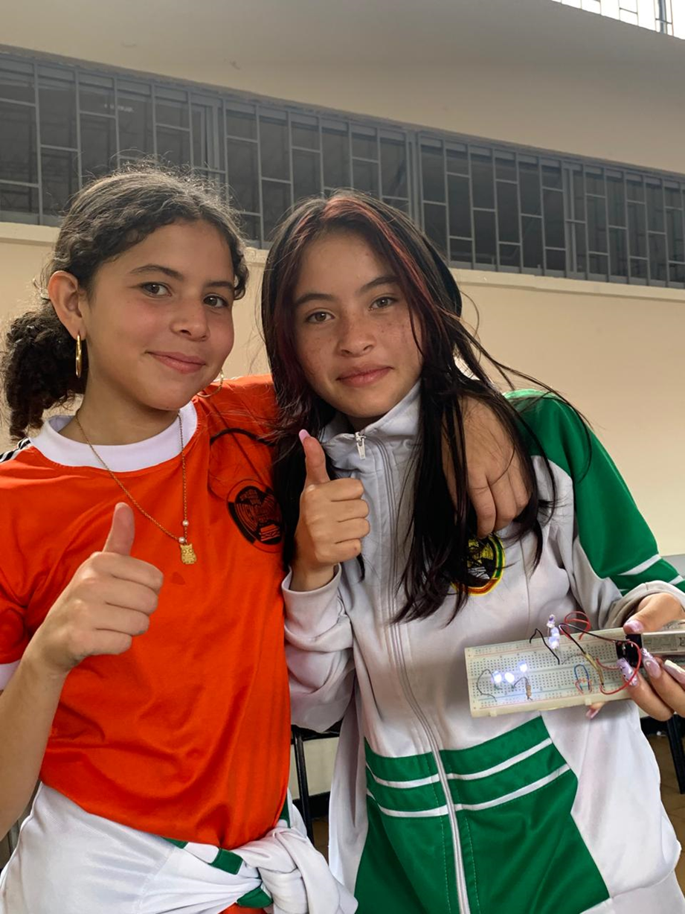
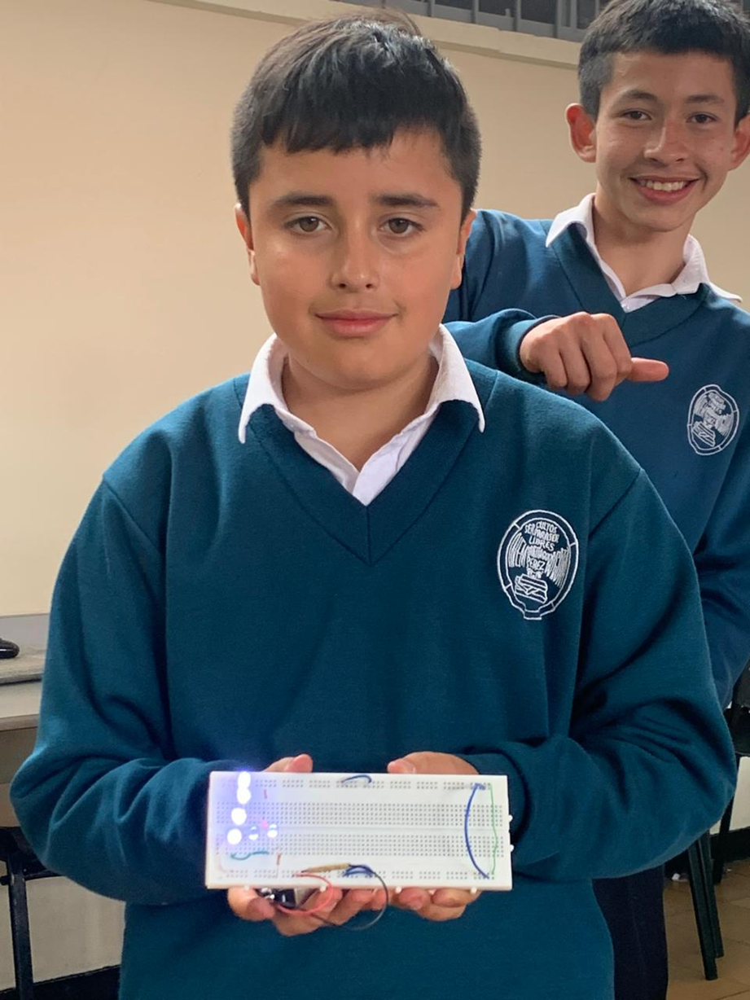
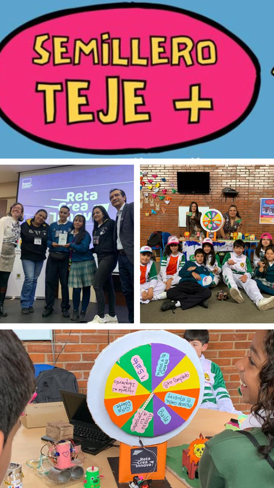
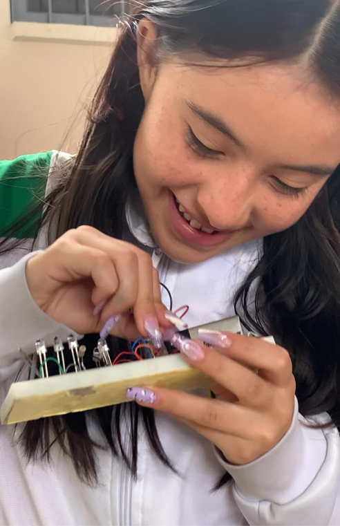
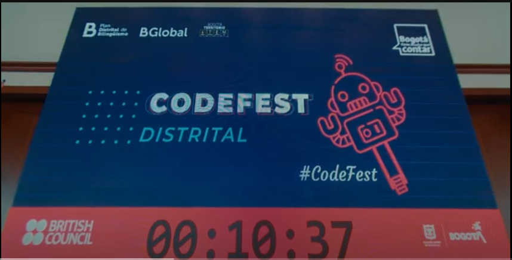
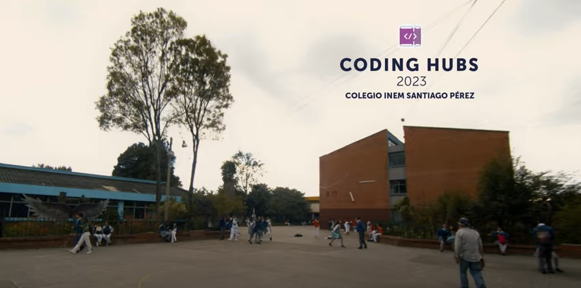
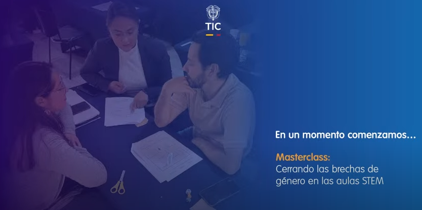
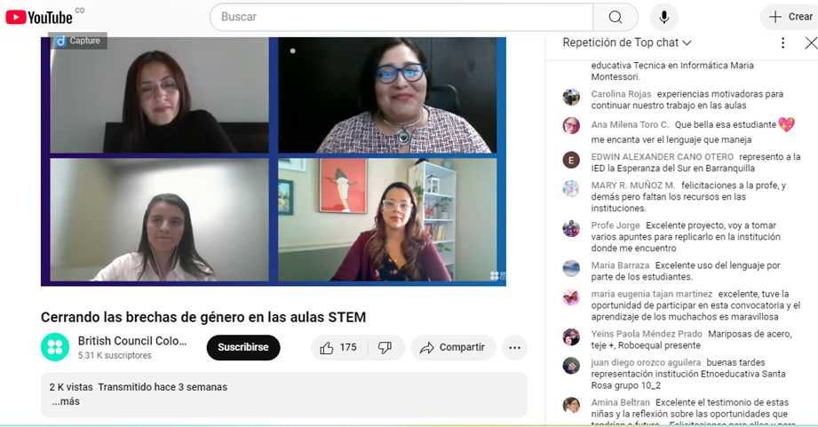
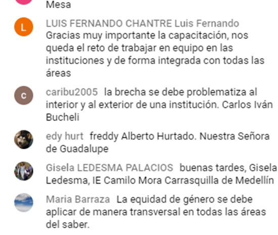
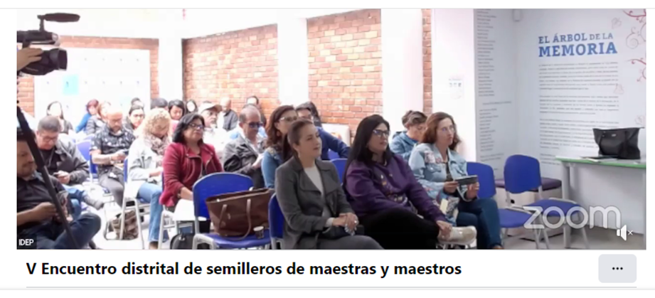

# SEMILLERO TEJE+

TEJE+ es un semillero comprometido con la promoción de la equidad de género a través de la robótica y las áreas STEM (Ciencia, Tecnología, Ingeniería y Matemáticas). Buscamos empoderar a niñas, niños y jóvenes de diversas comunidades, brindándoles herramientas y conocimientos para que puedan desarrollarse en el campo tecnológico, sin barreras de género.

<strong>
  <a href='https://drive.google.com/file/d/1V1K-5noWG76EDu0phEBQB1865SgEjYVM/view' target='blank'>Ver PDF</a>
</strong>

## ¿Qué hacemos en TEJE+?

1.	Promovemos la equidad de género en STEM:
    - Luchamos contra los estereotipos de género en la educación STEM, inspirando a las niñas y niños a interesarse por la tecnología y la robótica.
2.	Desarrollamos habilidades en robótica y programación:
    - Ofrecemos talleres  sobre robótica, programación y pensamiento computacional, utilizando herramientas como Arduino, Microbit y plataformas de programación visual.
    - Fomentamos la creatividad y el aprendizaje a través de la resolución de problemas con tecnologías actuales.
3.	Fomentamos el trabajo colaborativo:
    - Trabajamos en equipo para diseñar y construir proyectos de robótica, promoviendo la participación equitativa de todos los miembros.
    - Desarrollamos proyectos donde los estudiantes investigan, diseñan y ejecutan soluciones a problemas reales utilizando la tecnología.
4.	Organizamos actividades para la sensibilización y el empoderamiento:
    - Realizamos actividades que concientizan sobre la importancia de la igualdad de género en áreas tradicionalmente dominadas por hombres.
    - Organizamos encuentros, charlas y eventos con mentores y modelos a seguir que inspiran a niñas y jóvenes a perseguir sus intereses en STEM.
5.	Creamos redes de apoyo y aprendizaje:
    - Desarrollamos una comunidad en la que los estudiantes se apoyan mutuamente y comparten sus logros, aprendizajes y experiencias.

## Nuestra Misión:

Promover la equidad de género a través de la educación en robótica, inspirando y empoderando a niñas, niños y jóvenes para que desarrollen su potencial en las áreas STEM, y construyan un futuro con  oportunidades para todos.

 

## Hemos participado en:

### CODEFEST 2023

<strong>
  <a href='https://www.youtube.com/watch?v=QZ-rcsX7w-c' target='blank'>Visitar!!</a>
</strong>

 

### PROYECTO CODING HUBS

<strong>
  <a href='https://www.youtube.com/watch?v=WtUKggbJPco' target='blank'>Visitar!!</a>
</strong>

 

### MASTER CLASS: Cerrando las brechas de género en las aulas STEM "COLOMBIA PROGRAMA"

<strong>
  <a href='https://www.youtube.com/live/seHup4Ckig4' target='blank'>Visitar!!</a>
</strong>

### ENCUENTRO DE SEMILLEROS IDEP 2024:

  

<strong>
  <a href='https://www.facebook.com/idep.bogota/videos/v-encuentro-distrital-de-semilleros-de-maestras-y-maestros/2220806314946798/' target='blank'>Visitar!!</a>
</strong>

<!--  -->